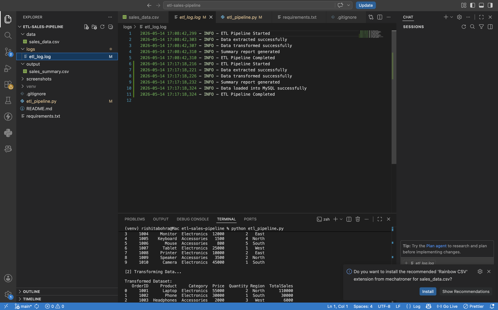
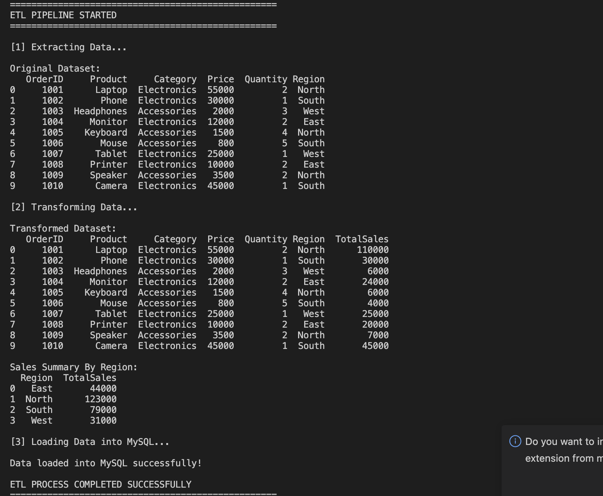
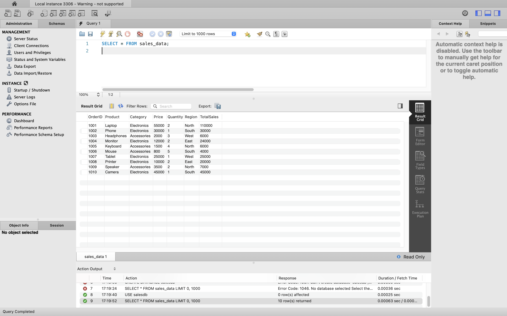

# ETL Pipeline for Sales Data

## 📌 Overview
This project demonstrates a complete ETL (Extract, Transform, Load) pipeline using Python, Pandas, and MySQL.

The pipeline extracts sales data from CSV files, performs data cleaning and transformation, generates analytics summaries, and stores processed data into MySQL.

---

# ✨ Features

- Extract sales data from CSV files
- Clean and transform datasets
- Generate analytics reports
- Store transformed data into MySQL
- Logging support for ETL operations
- Export processed summaries to CSV

---

# 🛠️ Technologies Used

- Python
- Pandas
- MySQL
- SQLAlchemy

---

# 📂 Project Structure

```bash
etl-sales-pipeline/
│
├── data/
│   └── sales_data.csv
│
├── logs/
│   └── etl_log.log
│
├── output/
│   └── sales_summary.csv
│
├── screenshots/
│   ├── etlpipeline-output.png
│   ├── projectstructure.png
│   ├── sqltable.png
│   └── sqltable copy.png
│
├── etl_pipeline.py
├── requirements.txt
├── sql_queries.sql
├── README.md
└── .gitignore
```

---

# 📸 Screenshots

## 📁 Project Structure


---

## ⚙️ ETL Pipeline Output


---

## 🗄️ MySQL Table


---


---

# 🚀 How to Run

## 1️⃣ Clone the Repository

```bash
git clone https://github.com/your-username/etl-sales-pipeline.git
```

---

## 2️⃣ Install Dependencies

```bash
pip install -r requirements.txt
```

---

## 3️⃣ Run the ETL Pipeline

```bash
python etl_pipeline.py
```

---

# 📈 Output

The pipeline will:

- Read sales data from CSV
- Clean missing/invalid values
- Generate summary reports
- Store transformed data in MySQL
- Save analytics output into CSV files

---

# 💡 Learning Outcomes

This project helped in understanding:

- ETL workflows
- Data cleaning using Pandas
- Database integration with MySQL
- SQLAlchemy ORM
- Logging and data processing pipelines

---

# 👩‍💻 Creator

## Rishita Bohra

Aspiring Software Engineer passionate about Data Engineering, AI/ML, and Full Stack Development.

---

# 📄 License

This project is created for educational and portfolio purposes.

---

# ⭐ Support

If you like this project:

- Star the repository
- Fork the project
- Share feedback
